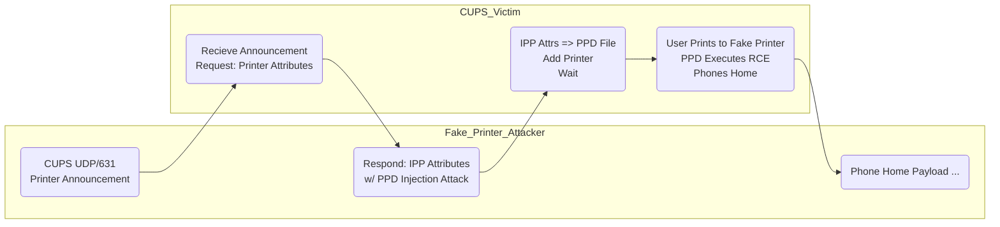

```mermaid
flowchart LR

    subgraph Fake_Printer_Attacker
        
        A(CUPS UDP/631 
            Printer Announcement)
        C(Respond: IPP Attributes
            w/ PPD Injection Attack)

        F(Phone Home Payload ...)
    end


    subgraph CUPS_Victim
        B(Recieve Announcement
            Request: Printer Attributes)
        D(IPP Attrs => PPD File
            Add Printer
            Wait)

        E(User Prints to Fake Printer
            PPD Executes RCE
            Phones Home)
    end


    A --> B
    B --> C
    C --> D
    D --> E
    E --> F


```
