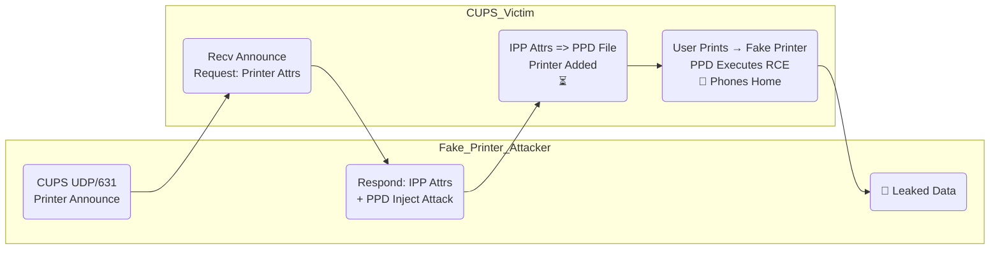

```mermaid
flowchart LR

    subgraph Fake_Printer_Attacker
        
        A(CUPS UDP/631 
            Printer Announce)
        C(Respond: IPP Attrs
            + PPD Inject Attack)

        F(📡 Leaked Data)
    end


    subgraph CUPS_Victim
        B(Recv Announce
            Request: Printer Attrs)
        D(IPP Attrs => PPD File
            Printer Added
            ⏳)

        E(User Prints → Fake Printer
            PPD Executes RCE
            📡 Phones Home)
    end


    A --> B
    B --> C
    C --> D
    D --> E
    E --> F

```
